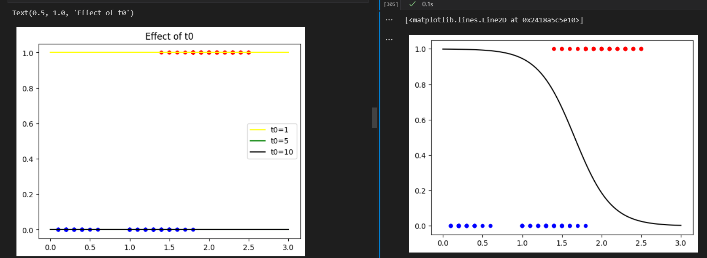
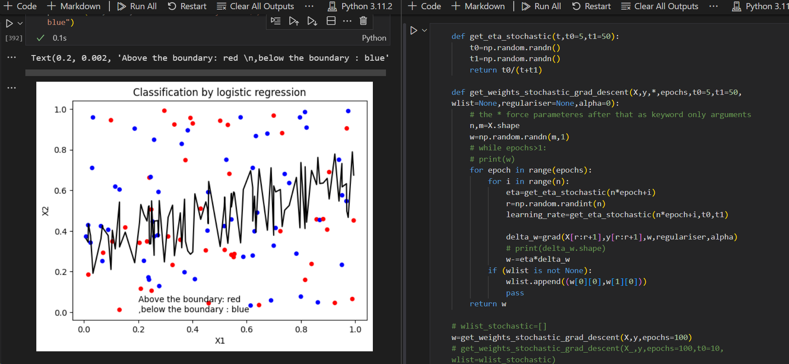
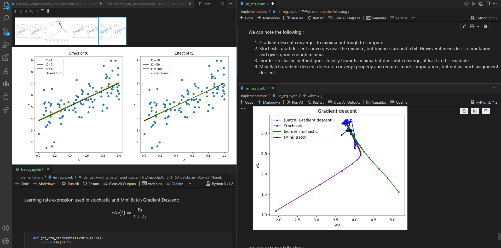
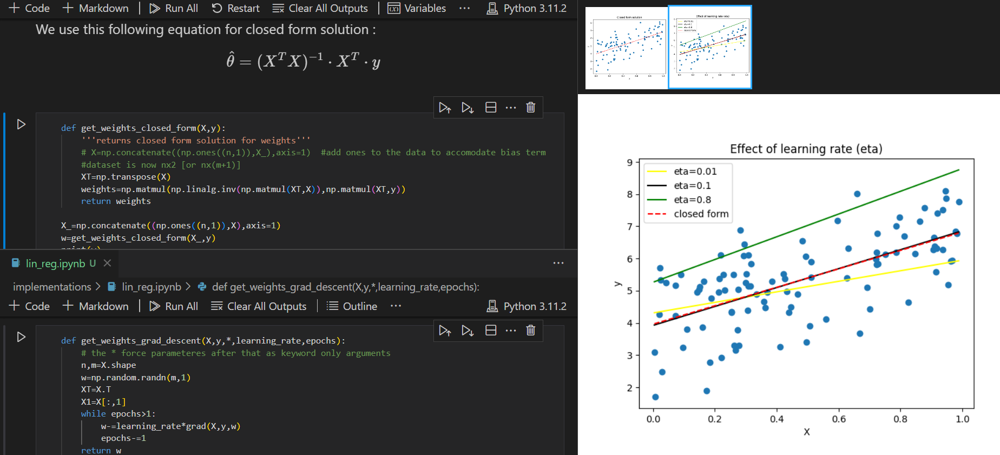
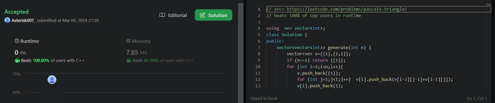

# 40-Days-Of-Code

40 days of code, starting from 6th March , 2024 to 14th April, 2024

## Day 5: March 10, Sunday

**Today's Progress**: Continued Logistic regression, changed dataset, my gradient descent algo still has some problem

**Thoughts** Lost motivation in evening and wasted time, started coding at midnight. Overall not very good day.  
PS : The plot on the left is using my implementation, right one is what i'm trying to reach

**Link(s) to work**

## Day 4: March 9, Saturday

**Today's Progress**: Started Logistic regression, but not getting good results, will improve tomorrow

**Thoughts** Had a productive day overall, but my implementation of logistic regression doesn't work well :( [The plot shown is also visibly messy]

**Link(s) to work**

## Day 3: March 8, Friday

**Today's Progress**: Finished unregularised Linear regression, will do regularised version tomorrow

**Thoughts** Wasted quite a lot of time today, and started coding late, so finished past midnight. Will start tomorrow morning itself.

**Link(s) to work**

## Day 2: March 7, Thursday

**Today's Progress**: Started implementing Linear regression (ML), halfway done

**Thoughts** Very fun. VScode dark mode is cherry on top.

**Link(s) to work**

## Day 1: March 6, Wednesday

**Today's Progress**: Started DP questions on Leetcode and interviewbit.

**Thoughts** Struggling to get proper DP intuition for now, only got some simple questions correct.

**Link(s) to work**

1. 
