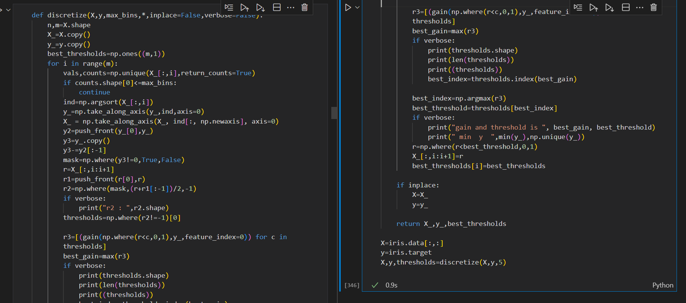

# 40-Days-Of-Code

40 days of code, starting from 6th March , 2024 to 14th April, 2024

try next : complete ID3, add plotting option with backtracking, on continuous data

## Day 23: March 28, Thursday

**Today's Progress**: Finished Pytorch code for linear dataset , will start on a non linear dataset next

**Thoughts** Linear regression is not as interesting as non linear data so i am glad i can start non linear data now!
**Link(s) to work** 1.

## Day 22: March 27, Wednesday

**Today's Progress**: Started writing classification code but opted for more tensors practice first

**Thoughts** This current work is comparatively easy but tedious. I hope i can finish the tensor operations tomorrow

**Link(s) to work** 1.

## Day 21: March 26, Tuesday

**Today's Progress**: Finished implementing utility functions (losses, activations etc), also implemented backpropagation. The backpropagation step is the 'backward' function in the code:

**Thoughts** Yesterday was slow, but today i made lot of progress.

**Link(s) to work** 1.

## Day 20: March 25, Monday

**Today's Progress**: Studied Maths for Loss functions and Backpropagation. Only maths, no coding , so no screenshots for today!

**Thoughts** I wasted quite a bit of time, hoped to reach the coding part but didnt reach. Will finish backpropagation tomorrow.

## Day 19: March 24, Sunday

**Today's Progress**: Studied and implemented activation functions

**Thoughts** I will be starting proper backpropagation around Day 21 or 22. Looking forward to that :)

**Link(s) to work** 1.

## Day 18: March 23, Saturday

**Today's Progress**: Started writing layers and forward pass for ANN

**Thoughts** Progress has sped up, but only a bit. I'm still optimistic.

**Link(s) to work** 1.

## Day 17: March 22, Friday

**Today's Progress**: Set up Pytorch and setup dataset loading

**Thoughts** Progress is slower than i thought, but alright.

**Link(s) to work** 1.

## Day 16: March 21, Thursday

**Today's Progress**: Studied maths for ANN, gonna start implementing tomorrow

**Thoughts** Due to some outside circumstance , I have to start ANN so i'll pause Classical ML for now and jump to ANN. I'm a bit nervous yet excited!

**Link(s) to work** Only maths, so no code for today

## Day 15: March 20, Wednesday

**Today's Progress**: Was not in right mindframe for ML so did graph algorithms practice instead.

**Thoughts** Today was also bit hectic, im gonna continue ML from 21st.

**Link(s) to work** 1.

## Day 14: March 19, Tuesday

**Today's Progress**: MISSED

**Thoughts** Quiz on 20th, plus poor time management on my part.

## Day 13: March 18, Monday

**Today's Progress**: Started implementing new algo for decision tree, only halfway done .

**Thoughts** Was very tired from classes so progress was very slow.

**Link(s) to work** 1.

## Day 12: March 17, Sunday

**Today's Progress**: Tested stuff on decision tree more. Unexpectedly, the tree which i thought was overfitting (the above one) is givin nearly 100% accurate results in testing, while the simplified model is failing. I plan to ask a friend about this tomorrow.
**Thoughts** Postponed some important stuff to the evening result of which couldnt do some of it. ML was main priority though. Will try not to repeat this tomorrow.

**Link(s) to work** 1.

## Day 11: March 16, Saturday

**Today's Progress**: Discretized the tree! Over two hours spent in writing the 'discretize' function , which converts the values from decimals to integers. Will wrap up decision trees tomorrow with some methods to increase accuracy, and some other algorithms which i find ( i only implemented the main one ID3).

**Thoughts** Wasted quite a bit of time today since no classes in afternoon. Coded late into the night, will probably have to catch sleep through naps.

**Link(s) to work**

1. This is the function! 
1. Discretising may seem simple, but basically my tree went from looking like the one at top, to the one at bottom. The accuracy dropped from 100% to 66%. I will work tomorrow on other methods to increase accuracy. 

## Day 10: March 15, Friday

**Today's Progress**: Continued Decision Tree. Finished implementing training part. Right now tree coming too big so pruning and testing accuracy etc steps are needed.

**Thoughts** Procastinated a bit in night so started the ML at midnight. Otherwise good day.
PS : Tree coming too big on actual dataset, so here i have shown the tree for small dataset (20 points).
**Link(s) to work**

1. 

## Day 9: March 14, Thursday

**Today's Progress**: Continued Decision Tree. Same deadline of completion : Day 10 or 11.

**Thoughts** Didn't have a good day, but tried to not let that affect my coding. Fell asleep on the laptop from exhaustion.  
PS No flashy stuff or plots today :)

**Link(s) to work**

1. 

## Day 8: March 13, Wednesday

**Today's Progress**: Finished Logistic regression (picture is of final results)   Also started decision trees. Will try and complete by Day 10-11.

**Thoughts** Had a busy evening but wasted time in afternoons. Coded late into the night. Gearing up for a busy Thursday as well.

PS the right half of the picture is new, the left half is more or less same as Day 7

**Link(s) to work**

1. 

## Day 7: March 12, Tuesday

**Today's Progress**: Continued Logistic regression, Managed to fix the last bugs with some outside help, now my predictions are coming properly.  
My training accuracy and predictions are similar to sklearn's , but my weights are somewhat different. Will explore more on this tomorrow

**Thoughts** Wasted a bit of time but got on track in evening. Successful day overall :)

**Link(s) to work**

1. 

## Day 6: March 11, Monday

**Today's Progress**: Continued Logistic regression, With some tinkering around, and introducing some randomness, now im managing to get a good curve ~ 50% of the time.

**Thoughts** Had a long day so not much time for myself, fell asleep after coding for an hour.  
PS : The plot on the left is using my implementation, right one is what i'm trying to reach

**Link(s) to work**

1. 

## Day 5: March 10, Sunday

**Today's Progress**: Continued Logistic regression, changed dataset, my gradient descent algo still has some problem

**Thoughts** Lost motivation in evening and wasted time, started coding at midnight. Overall not very good day.  
PS : The plot on the left is using my implementation, right one is what i'm trying to reach

**Link(s) to work**

1. 

## Day 4: March 9, Saturday

**Today's Progress**: Started Logistic regression, but not getting good results, will improve tomorrow

**Thoughts** Had a productive day overall, but my implementation of logistic regression doesn't work well :( [The plot shown is also visibly messy]

**Link(s) to work**

1. 

## Day 3: March 8, Friday

**Today's Progress**: Finished unregularised Linear regression, will do regularised version tomorrow

**Thoughts** Wasted quite a lot of time today, and started coding late, so finished past midnight. Will start tomorrow morning itself.

**Link(s) to work**

1. 

## Day 2: March 7, Thursday

**Today's Progress**: Started implementing Linear regression (ML), halfway done

**Thoughts** Very fun. VScode dark mode is cherry on top.

**Link(s) to work**

1. 

## Day 1: March 6, Wednesday

**Today's Progress**: Started DP questions on Leetcode and interviewbit.

**Thoughts** Struggling to get proper DP intuition for now, only got some simple questions correct.

**Link(s) to work**

1. 
